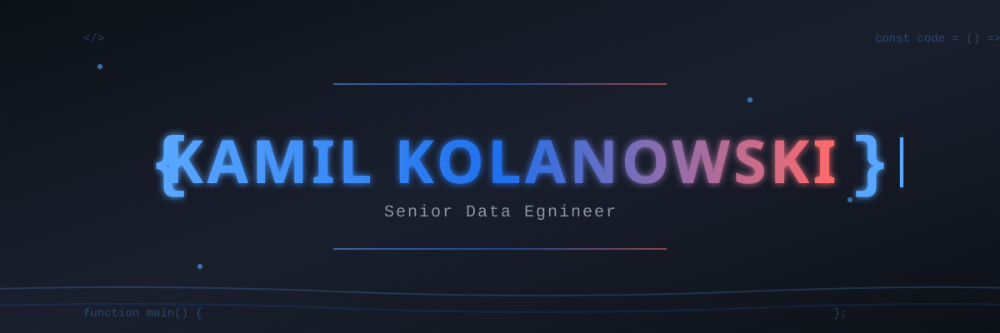

---

## 🛠️ Tech Arsenal

### Languages & Frameworks

  

### Cloud & DevOps

  

### IDEs & Text Editors

  

### Operating Systems

  

---

### 💬 Let's Connect

*Always open to interesting conversations about data engineering, jazz, or that perfect intersection of art and code*

---

*"In data we trust, in jazz we groove"* 🎷

